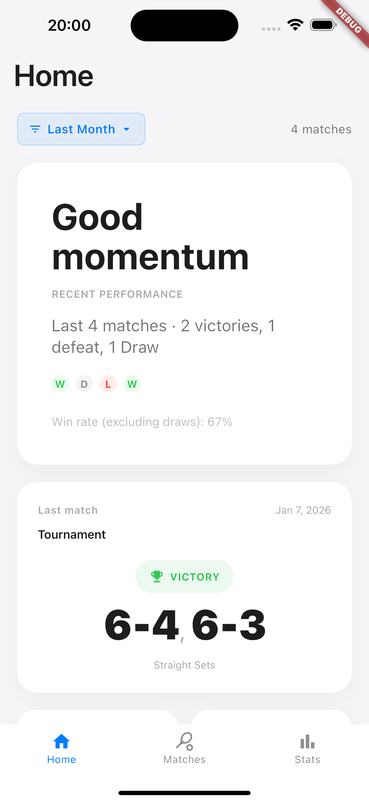
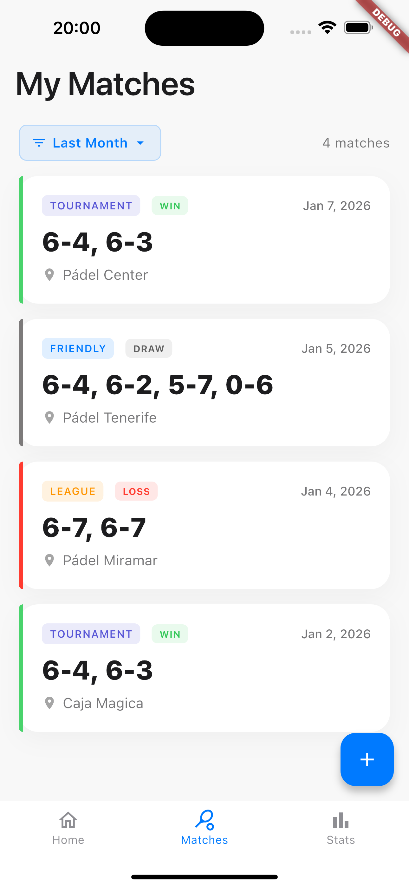
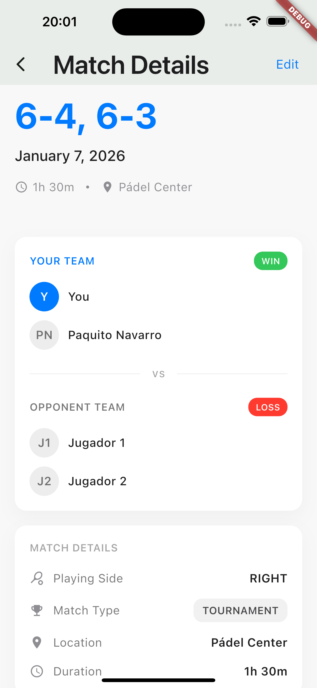
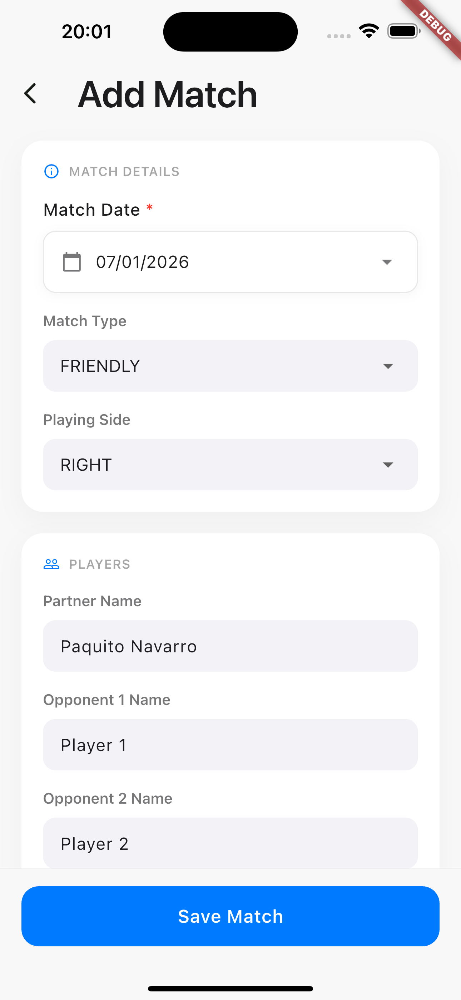
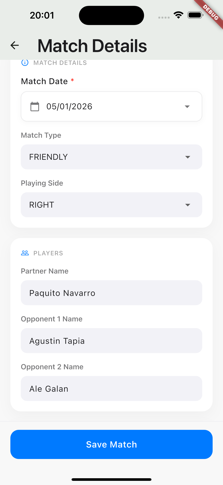
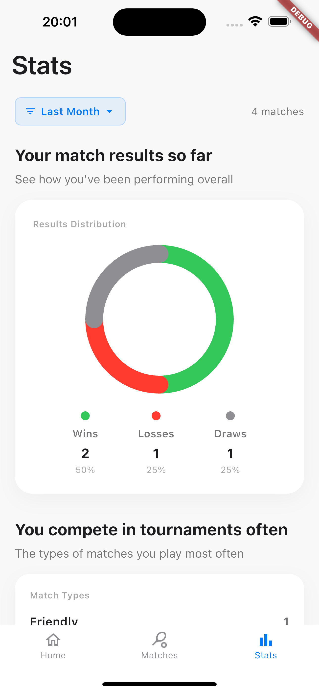
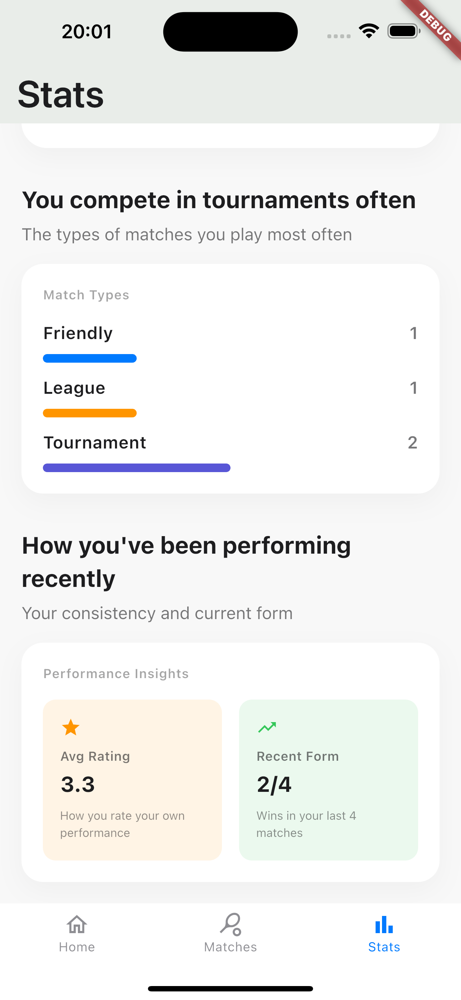

# DelYo

Track your padel journey with simplicity and privacy.

## About

DelYo helps you build a complete history of your padel matches. Whether you're playing friendly games, competing in leagues, or participating in tournaments, keep track of your progress without the hassle of complex features or mandatory sign-ups.

## 🌍 Multi-Language Support

DelYo is available in **6 languages** with complete localization:

- 🇺🇸 **English** - Default language
- 🇪🇸 **Spanish (Español)** - Complete with padel terminology
- 🇮🇹 **Italian (Italiano)** - Full localization
- 🇸🇪 **Swedish (Svenska)** - Complete translation
- 🇫🇷 **French (Français)** - Full localization
- 🇵🇹 **Portuguese (Português)** - Complete translation

The app automatically detects your device's language and displays the interface in your preferred language. All features, including performance feedback, statistics, and error messages, are fully translated.

**More languages coming soon!** We're continuously working to add support for additional languages to make DelYo accessible to padel players worldwide.

## Screenshots

| Home | My Matches | Match Detail |
|------|------------|--------------|
|  |  |  |

| Add Match | Edit Match | Stats (Overview) |
|-----------|------------|------------------|
|  |  |  |

| Stats (Details) |
|-----------------|
|  |

## Features

### Match Management
- **Create Matches**: Record new matches with date, match type, players, and results
- **Match Types**: Categorize matches as Friendly, League, or Tournament with visual color coding
- **Player Management**: Add and manage your partners and opponents
- **Results Tracking**: Simple win/loss recording for each match

### Views
- **Home**: Overview of recent activity and quick access to key features
- **My Matches**: Complete list of all your matches with filtering options
- **Stats**: Basic statistics with plans for visual charts and advanced analytics

### Filtering Options
- Last month
- Last 3 months  
- Last year
- All matches

### Why DelYo
- **Start Immediately**: No accounts, no setup - just download and begin tracking
- **Your Data, Your Device**: Everything stays private on your phone
- **Works Everywhere**: No internet required - track matches anywhere
- **Stay Focused**: Clean interface without distracting social features or ads
- **Speaks Your Language**: Available in 6 languages with automatic detection

## Download and Install

DelYo will be available on:
- **App Store** (iOS)
- **Google Play Store** (Android)

Currently in development - check back soon for release updates.

## What's Coming

### Available Now
- Track all your matches with dates, types, and results
- View match history with flexible time filters
- See basic statistics about your performance
- Organize matches by type: Friendly, League, Tournament

### Coming Soon
- **Visual Progress Charts**: See your improvement over time with graphs and trends
- **Advanced Statistics**: Deeper insights into your playing patterns and performance
- **Export Your Data**: Download your match history for your records
- **Optional Cloud Backup**: Keep your data safe across devices (completely optional)

### Future Ideas
- Tournament progress tracking
- Court location notes
- Match photos and memories

## Contributing

This project is currently in active development. If you'd like to contribute:

1. Fork the repository
2. Create a feature branch
3. Make your changes
4. Submit a pull request

### 🌐 Adding New Languages

We welcome contributions for new language translations! To add support for a new language:

1. **Create a new ARB file**: Copy `lib/l10n/app_en.arb` to `lib/l10n/app_[locale].arb` (e.g., `app_de.arb` for German)
2. **Translate all strings**: Replace English text with translations in your target language
3. **Add locale to main.dart**: Include the new locale in the `supportedLocales` list
4. **Test the implementation**: Run `flutter gen-l10n` and test the app
5. **Submit a pull request**: Include your new language file and locale configuration

**Translation Guidelines:**
- Use appropriate padel terminology for your language/region
- Keep performance messages motivational and contextually appropriate
- Maintain consistency in terminology throughout the app
- Test all features to ensure translations display correctly

**Languages we'd love to add:**
- 🇩🇪 German (Deutsch)
- 🇳🇱 Dutch (Nederlands)
- 🇷🇺 Russian (Русский)
- 🇯🇵 Japanese (日本語)
- 🇨🇳 Chinese (中文)
- And many more!

## Documentation

For detailed project information, see the documentation in the `docs/` folder:

- **[Roadmap](docs/ROADMAP.md)**: Feature roadmap and development timeline
- **[Architecture Decisions](docs/DECISIONS.md)**: Technical decisions and rationale
- **[Localization Guide](docs/LOCALIZATION.md)**: Multi-language support and translation guidelines

## License

This project is licensed under the MIT License - see the [LICENSE](LICENSE) file for details.

## Support

If you encounter any issues or have suggestions, please open an issue on GitHub.
